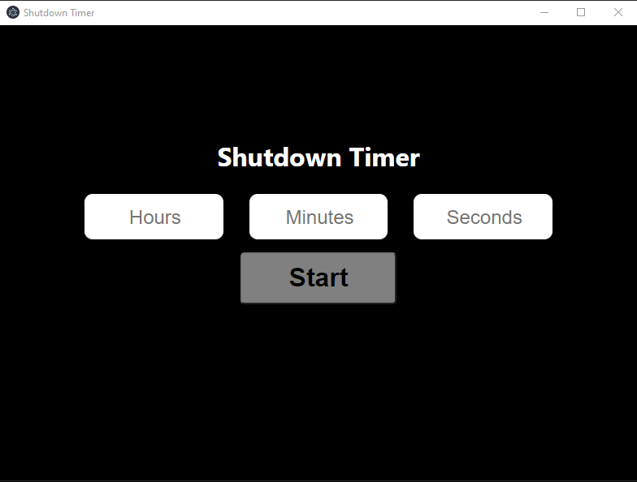

# Shutdown Timer

A simple app to shutdown a computer based on a time interval.

## Requirements

Assuming you have [npm](https://www.npmjs.com) installed, clone the repo and run the following code:

```
npm install
```

## Usage

Inside the cloned folder run:

```
npm start
```

## Example

<p align="center">
   
</p>